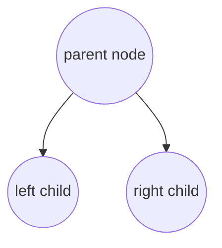
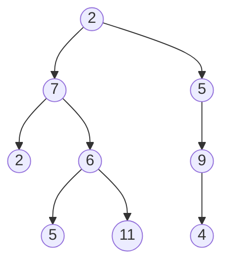
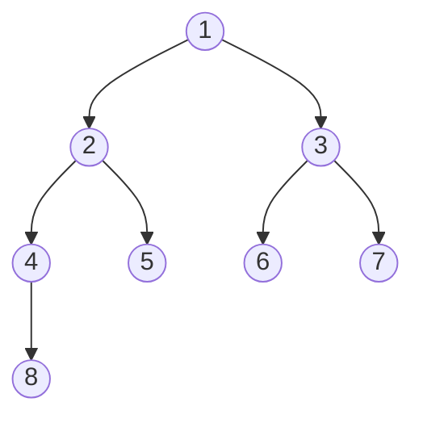
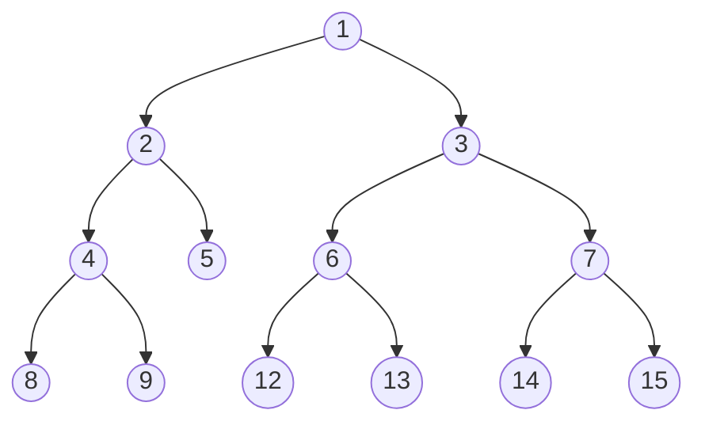

# Notes: Binary Trees in Python

 A **binary tree** is a tree data structure in which each node has at most two children. Another way of phrasing it is a parent, connected with two children. Each child can, in turn, be considered a parent.

 Nodes which have no children are called leaf nodes.





The depth of a node is measured by the length of the path from node $n$ to the $root$ node.

In the above graph, the node with a depth of 0 would be 2, the root node.

A trees *height* is the length of a path from n to the trees deepest descendant. The total tree height is the height of the root node. Leaf nodes have a height of 0.

A **complete** binary tree consists of each level the tree being completely filled, except the last. The nodes in the last level will be located as far left as possible.



A **full** binary tree contains nodes which have either two or zero children A full tree is also known as a **proper** or **plane** binary tree



## Data Structure

### Node

```python
# Note: in python 3 inheriting from the object class is implied and is not necessary
# for more information see this link: https://stackoverflow.com/questions/4015417/why-do-python-classes-inherit-object
class Node:
    def _init__(self, data):
        self.data = data
        self.left = None
        self.right = None
```

### Binary Tree

```python
def __init__(self, root):
    self.root = Node(root)
```

## Traversal

The three types of traversals we should consider are:

* Pre-order
* In-order
* Post-order

### Pre-Order

* Check if the current node is empty/null
* Display the data associated with the current node
* Traverse the left subtree

```python
def preorder_print(self, start, traversal):
    """ Root => Left => Right """
    if start:
        traversal += (str(start.value) + "-")
        traversal = self.preorder_print(start.left, traversal)
        traversal = self. preorder_print(start.right, traversal)
    return traversal
```

### In-order

* Check if the current node is empty/null
* Traverse the left subtree by recursively calling the in-order method
* Display the data part of the root (or current node)
* Traverse the right subtree by recursively calling the in-order method

```python
def inorder_print(self, start, traversal):
    """ Left => Root => Right """
    if start:
        traversal = self.inorder_print(start.left, traversal)
        traversal += (str(start.value) + "-")
        traversal = self.inorder_print(start.right, traversal)
    return traversal
```

### Post-Order

* Check if the current node is empty/null
* Traverse the left subtree by recursively calling the post-order method
* Traverse the right subtree by recursively calling the post-order method
* Display the data part of the root (or current node)

```python
def postorder_print(self, start,  traversal):
    """ left => Right => Root """
    if start:
        traversal = self.postorder_print(start.left, traversal)
        traversal = self.postorder_print(start.right, traversal)
        traversal += (str(start.value) + "-")
    return traversal
```


