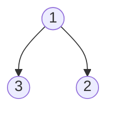
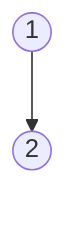

# Notes: Week 2

## Practice Problem: Find Only Children

I was unable to visualize an answer to this challenge.
The recommended approach is as follows:

```python
def findOnlyChildren(root: TreeNode) -> List[int]:
    parents = []
    
    def dfs(node: TreeNode) -> None:
        if not node:
            return
        if node.left and not node.right:
            parents.append(node.value)
        elif not node.left and node.right:
            parents.append(node.value)
        dfs(node.left)
        dfs(node.right)
    
    dfs(root)
    return parents
```

The above code passes the following test case

```python
def test_1(self):
    tree = TreeNode(1,
                    TreeNode(2, None, TreeNode(4)),
                    TreeNode(3, None, None))
    self.assertEqual([2], findOnlyChildren(tree))
```

Goals:

* memorize depth first search
* memorize breadth first search

## Algo: Check Strings Are Rotation Of Each Other

link: https://leetcode.com/problems/rotate-string/solution/

Another problem I'm having difficulty figuring out.

My solution:

```python
def rotateString(s: str, goal: str) -> bool:
    if len(s) != len(goal):
        return False
    if not s or not goal:
        return False
    if len(s) == 0:
        return False
    
    # Search s for first character in goal
    pos = s.find(goal[0])
    if pos == -1:
        return False
    elif 
    
    for character in goal:
        if character != s[pos]:
            return False
        pos = (pos + 1) % len(s)
        print(f"DEBUGGING: pos{pos}")
    return True

class TestSolution(unittest.TestCase):
    def test_1(self):
        # Fails on this test case
        s ="bbbacddceeb"
        goal ="ceebbbbacdd"
        self.assertTrue(rotateString(s, goal))
```

The issue with this solution is that it only works if there is a single occurrence of the starting character in the goal string.
An update to this solution would be to first determine the number of occurrences of the starting character. We can then repeat the rotateString function for each occurrence of the starting character.

### Leetcode solution:

NOTE: this is a user solution, not the solution provided by leetcode. That solution seems convoluted and wouldn't be something I'd ever come up with on my own.

```python
# user solution
def rotateString(self, s: str, goal: str) -> bool:
    ans = False
    for i in range(len(s)):
        if goal == (s[i:]+s[:i]):
            ans = True
    return(ans)

# simple leetcode solution
def rotateString(self, A, B):
        return len(A) == len(B) and B in A+A

# crazy leetcode rolling hash solution
def rotateString(self, A, B):
    # O(n) time where time is len(a) and O(n) space
    MOD = 10**9 + 7
    P = 113
    Pinv = pow(P, MOD-2, MOD)

    hb = 0
    power = 1
    for x in B:
        code = ord(x) - 96
        hb = (hb + power * code) % MOD
        power = power * P % MOD

    ha = 0
    power = 1
    for x in A:
        code = ord(x) - 96
        ha = (ha + power * code) % MOD
        power = power * P % MOD

    if ha == hb and A == B: return True
    for i, x in enumerate(A):
        code = ord(x) - 96
        ha += power * code
        ha -= code
        ha *= Pinv
        ha %= MOD
        if ha == hb and A[i+1:] + A[:i+1] == B:
            return True
    return False
```

## Notes: Coding Drills Recursion on Linked Lists

Recursion:

Top-down: the approach where we break down our input until reaching the base case and start constructing the answer as we go back up the call stack

Bottom-up: we have an extra parameter that holds our result as we go through the input and return the result at the end.

```python
# Question 1
'''
Given a linked list and an integer find whether the integer exists in the list

Base Case: if our current node is null return false. We're at the end of the list here
Recursive Case: If our current nodes value is our target, return True, else return recursive call to next node
'''
def findTargetInLL(head, target):
    if not head:
        return False
    if head.value == target:
        return True
    return findTargetInLL(head.next, target)
```

```python
# Question 2
'''
Prompt:
Given a linked list and a target integer, return the number of times the target exists.

Base Case:
  if current node is null, return the count

Recursive Case:
  if current.value == target increment count
  recursive function call, passing current.next, target, and count

'''
def countOccurrences(head, target):
    count = 0
    def helperCountOccurrences(head, target):
        if not head:
            return
        if head.value == target:
            count += 1
        return helperCountOccurrences(head.next, target, count)
```


```javascript
// Question 3
function findOccurrencesTD(head, target) {
    // base case
    if (!head) return 0
    if (head.value === target) return 1 + findOccurrencesTD(head.next, target)
    return findOccurrencesTD(head.next, target)
}
```


```javascript
// Question 4
/*
    Find the mean of a linked list of integers
    Average = sum of elements / number of elements

    use the sum variable in our params
    and use a count variable in our params

    base case:
        if current node is null, return sum / count
    recursive case:
        add node value to our sum var
        add 1 to our count var
        return recursive call on next node and updated params     
 */
function meanOfLL(head) {
    return helper(head, 0, 0)
}

function helper(head, count, sum) {
    if (!head) {
        if (!count) return 0
        return sum / count
    }
    return helper(head.next, count+1, sum+head.value);
}
```

We also worked on reversing a linked list
This would be a good thing to practice!

## Practice Problem: Get all subsequences

Here, we want to find all the combinations of characters from a given string

```
input = "abc"
result = ['a', 'b', 'c', 'ab', 'ac', 'bc', 'abc']
```

```python
### Solution modified from https://www.geeksforgeeks.org/print-all-combinations-of-given-length/

def printAllKLength(set):
    result = []
    for k in range(1, len(set)+1):
        items = []
        printAllKLengthRec(set, "", len(set), k, items)
        for item in items:
            if item not in result:
                result.append(item)
    return result

# The main recursive method
# to print all possible
# strings of length k


def printAllKLengthRec(set, prefix, n, k, result):
    # Base case: k is 0,
    # print prefix
    if (k == 0):
        if prefix != "":
            if ''.join(sorted(prefix)) not in result:
                result.append(prefix)
        return
    # One by one add all characters
    # from set and recursively
    # call for k equals to k-1
    for i in range(n):
        # Next character of input added
        newPrefix = ""
        if set[i] not in prefix:
            newPrefix = prefix + set[i]
        # k is decreased, because
        # we have added a new character
        printAllKLengthRec(set, newPrefix, n, k - 1, result)


print(printAllKLength("abc"))

```


## Notes: Coding Drills Find Max Element in BT Variations

Recursion is basically a stack!

```python
def count(root, target) -> int:
    if not root: 
        return 0
    targetCount = 0
    def dfs(node):
        if(not node): return
        if(node.left is not None):
            dfs(node.left)
        if(node.right is not None):
            dfs(node.right)
        if(node.value == target):
            nonlocal targetCount
            targetCount +=1
    dfs(root)
    return targetCount

# "create the same function without the helper function"
def count_v2(node, target) -> int:
    if node is None:
        return 0
    # note: int(node.value == target) this allows us to bypass an if block.
    return count_v2(node.left, target) + count_v2(node.right, target) + int(node.value == target)
```

Good quesiton for this problem (count number of times a value is seen in the tree):

> What if I'm given an empty tree? What should I return?

Question
Given a tree of positive nodes, find the smallest positive value

> How should I deal with the value of zero?

float("inf") returns the largest positive integer value

```python
def smallest_value(node):
    if node is None:
        return float("inf")
    return min(node.value, smallest_value(node.left), smallest_value(node.right))

def main(node):
    if node is None:
        return -1
    return smallest_value(node)
```

Count occurrences of elements in a tree: Majority algorithm:
* Majority Algotithm: Boyer–Moore majority vote algorithm


## Notes Meeting: Concept Drills Recursion

### Recursion tips and hints

Recursion: a function that calls itself

- as the function continues to call itself, the input should be getting smaller somehow
- always keep in mind what TYPE your function should return

- imagine you have a magic function that does what you need to do, but ONLY for the n - 1 scenario
- given that magic function's return value, what do we need to do to merge it and get the result for the N scenario

### Problem sum elements in a linked list:

```python
def sumElements(head):
    if not head:
        return 0
    return head.value + sumElements(head.next)
```

Here's another way to think about the base case

```javascript
const sumValuesOfList = (head) => { // returns a number
  if (!head.next) {
    return head.val;
  }
  const sumOfRestOfList = sumValuesOfList(head.next);
  return head.val + sumOfRestOfList;
}
```

Instead of waiting for head to be null, we can check if the next node is null and simply return the value of the current node.


```javascript
/*

Given N and M representing a matrix of N by M, find the number of unique paths to get from the top left cell to the top right cell of the matrix. The only valid moves that can be made are:
- 1 step to the right
- 1 step diagonally up to the right
- 1 step diagonally down to the right

[0, 0, 0] => 2
[0, 0, 0]
[0, 0, 0]

[4, 2, 1, 0]
[0, 2, 1, 0]
[0, 1, 0, 0]

*/

const findNumUniquePaths = (matrix, row = 0, col = 0) => {
  if (row === 0 && col === matrix[0].length - 1) { // reached target cell 
    return 1;
  }
  if (row < 0 || row > matrix.length || col < 0 || col > matrix[0].length) {
    return 0;
  }

  let numPaths = 0;

  numPaths += findNumUniquePaths(matrix, row, col + 1) // to the right
  numPaths += findNumUniquePaths(matrix, row - 1, col + 1) // up and to the right
  numPaths += findNumUniquePaths(matrix, row + 1, col + 1) // down and to the right

  return numPaths;
}

const testMatrix = [
  [0, 0, 0, 0],
  [0, 0, 0, 0],
  [0, 0, 0, 0],
]

console.log(findNumUniquePaths(testMatrix));
```

## Question: Flatten a list which consists of a combination of sublists and integers. Note: each value 

Note: I was unable to find the solution to this on my own. The solution I submitted was found in the problem discussion tab at the LeetCode problem page: https://leetcode.com/problems/flatten-nested-list-iterator/

```python
class NestedIterator:
    def __init__(self, nestedList: [NestedInteger]):
        self.generator = self.gen(nestedList)
        self.cache = None
        
    def gen(self, nestedList):
        for elt in nestedList:
            if elt.isInteger():
                yield elt.getInteger()
            else:
                yield from self.gen(elt.getList())
    
    def next(self) -> int:
        return self.cache
    
    def hasNext(self) -> bool:
        self.cache = next(self.generator, None)
        return self.cache is not None
```

This solution utilizes the concept of a [python generator](https://docs.python.org/3/c-api/gen.html).
Use this link to learn about [generators and yield](read://https_realpython.com/?url=https%3A%2F%2Frealpython.com%2Fintroduction-to-python-generators%2F).

TODO: Review the problem, solution, and generators/yield insights

## Practice Problem: Parent Sum Tree

For this problem I got the recursion correct, however I failed to identify that a wrapper function was needed. In my original solution, I became stuck when I realized that I needed to return a tree and that my current implementation made that difficult.

I ended up looking at the approach tab which indicated that a nested helper function might be a good idea

Key takeaway: Remember that you can create helper functions to assist in solving the problem!

```python
# original solution
def createParentSumTree(root: TreeNode) -> TreeNode:
    if not root:
        return
    if root.left:
        root.left.value += root.value
        root.right.value += root.value
    if root.right:
    createParentSumTree(root.left)
    createParentSumTree(root.right)
    

# passing solution
def createParentSumTree(root: TreeNode) -> TreeNode:
    result = root

    def dfs(node):
        if not root:
            return
        if root.left:
            root.left.value += root.value
        if root.right:
            root.right.value += root.value
        createParentSumTree(root.left)
        createParentSumTree(root.right)
    dfs(root)
    return result
```

## Practice Problem: Tree Flip

Given a binary tree, return its reflection:




```python
# Solution:
# time: O(n) where n is the number of nodes
# space: O(n) where n is the number of function calls in the stack frame
def flip(root: TreeNode) -> TreeNode:
    current = root

    def dfs(node):
        if not node:
            return
        # for every node in the tree, swap the left and right subtree
        node.left, node.right = node.right, node.left
        dfs(node.left)
        dfs(node.right)

    dfs(current)
    return root
```

Takeaways:

* Make sure your test cases are correct!
* Make sure you call the nested function!
  * I spent a few minutes stepping through a happy test case, when the answer was simply to look at the code and see a missing function call. I'd say this is also due to the fact that I wrote the function as I came up with the pseudocode. Try to stick with the engineering method as much as possible.

## Practice Problem: Tree Pruning

Given a binary tree and a value, remove the subtrees who's root have this target value.


becomes



### Solution

```python
def pruneSubtree(root: TreeNode, target: int) -> TreeNode:
    """search a binary tree for a node with a given value. If a node exists with that value, prune the branch from the tree

    Args:
        root - The root of the tree
        target - the value we want to search for
    Returns:
        the root of the updated tree
    """
    if root.value == target:
        return None
    
    current = root
    def dfs(node):
        if node.left and node.left.value == target:
            node.left = None
        if node.right and node.right.value == target:
            node.right = None
        if node.left is None and node.right is None:
            return
        
        if node.left:
            dfs(node.left)
        if node.right:
            dfs(node.right)
    
    dfs(current)
    return root
```

### Takeaways

The code has a lot of if statements. The reasoning for this is based on the following hint from the problems approach blurb:

> At ever node, check it's left and right children for the target value. Set that child pointer to null.

Originally, my base case looked like this:

```python
if node is None:
    return
```

This didn't seem appropriate, as the approach section focused on the child nodes. This leads to three base cases:

1. the left child has the target value
2. the right child has the target value
3. there is no left or right child

We can finally reach the recursive step. Here we have to take care to check if the node exists as we haven't controlled for that with any of the base cases.

The more I look through this code, the more my solution seems like a good one. It is a lot of if

### Updates

Here is a cleaner version of the code:

```python
def pruneSubtree1(root: TreeNode, target: int):
    if not root:
        return root
    if root.value == target:
        return None

    current = root

    def dfs(node):
        if not node:
            return node
        if node.value == target:
            return None
        node.left = dfs(node.left) 
        node.right = dfs(node.right)
        return node

    dfs(current)
    return root
```

## Practice Problem: Sum Nodes With Even Valued Parent

Given the root of a binary tree, find the sum of children nodes whose parent is even.

### Solution

```python
def sumNodesWithEvenParent(root: TreeNode) -> int:
    if not root:
        return 0
    _sum = 0
    if not root.value % 2:
        _sum = _sum + root.left.value if root.left else 0
        _sum = _sum + root.right.value if root.right else 0
    return _sum + sumNodesWithEvenParent(root.left) + sumNodesWithEvenParent(root.right)
```

### Takeaways

Originally, I had understood the problem and worked through an example by hand before programming.
Once I began to code, however, I solved a different problem where I summed the nodes whose values were even.

Remember to make sure you're following the pseudocode! Also, make double sure you understand the problem!

```javascript
function convertToBase(number) {

  function helper(number) {
    const currNum = number % 3;
    const restToProcess = (number - currNum) / 3;
    return (restToProcess !== 0 ? helper(restToProcess) : '') + currNum.toString();
  }

  if (number < 0) {
    return "-" + helper(number * -1);
  }
  return helper(number);
}
```